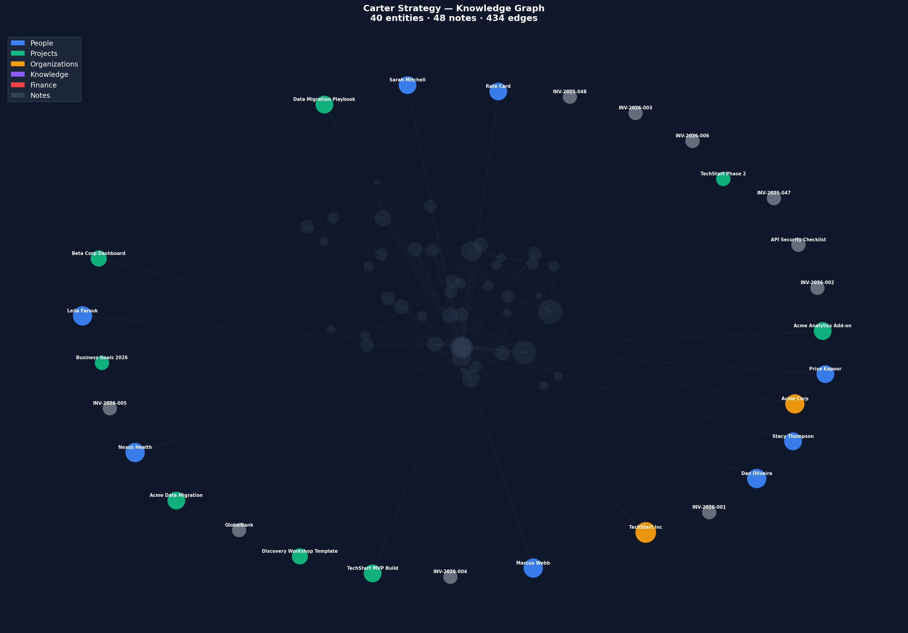

<div align="center">
  
  <h1>Flywheel</h1>
  <p><strong>Your Obsidian vault, wired.</strong><br/>
  Search, write, and graph tools that auto-link your notes and learn from your edits.<br/>
  All local. All markdown. A few lines of config.</p>
</div>

[](https://www.npmjs.com/package/@velvetmonkey/flywheel-memory)
[](https://modelcontextprotocol.io/)
[](https://github.com/velvetmonkey/flywheel-memory/actions/workflows/ci.yml)
[](https://www.gnu.org/licenses/agpl-3.0)
[](docs/SETUP.md)
[](https://github.com/velvetmonkey/flywheel-memory)
[-brightgreen.svg)](docs/TESTING.md#retrieval-benchmark-hotpotqa)
[](docs/TESTING.md#retrieval-benchmark-locomo)
[](docs/TESTING.md)

**[See It Work](#see-it-work)** · **[Try It](#try-it)** · **[What Makes It Different](#what-makes-flywheel-different)** · **[Benchmarked](#benchmarked)** · **[Tested](#tested)** · **[Docs](#documentation)**

| | Without Flywheel | With Flywheel |
|---|---|---|
| "What's overdue?" | Read every file | Indexed query, <10ms |
| "What links here?" | Grep the vault, flat list | Ranked backlinks + outlinks, pre-indexed |
| "Add a meeting note" | Raw write, no linking | Auto-wikilinks on every mutation |
| "What should I link?" | Not possible | 13-layer scoring engine + semantic search |
| "Export my knowledge graph" | Not possible | GraphML export → open in Gephi, Cytoscape, NetworkX |
| Token cost per query | Hundreds to thousands | Graph does the joining — one search, not ten file reads |

---

## See It Work

### Read: "How much have I billed Acme Corp?"

From the [carter-strategy](demos/carter-strategy/) demo — a solo consultant with 3 clients, 5 projects, and $27K in invoices.

<video src="https://github.com/user-attachments/assets/ec1b51a7-cb30-4c49-a35f-aa82c31ec976" autoplay loop muted playsinline width="100%"></video>

One search call returned everything — metadata (frontmatter) with amounts and status, backlink lists, outlink lists. Zero file reads needed. The graph did the joining, not the AI reading files one by one.

### Write: Auto-wikilinks on every mutation

```
❯ Log that Stacy reviewed the security checklist before the Beta Corp kickoff

● flywheel › vault_add_to_section
  path: "daily-notes/2026-01-04.md"
  section: "Log"
  suggestOutgoingLinks: true
  content: "[[Stacy Thompson|Stacy]] reviewed the [[API Security Checklist|security checklist]]
            before the [[Beta Corp Dashboard|Beta Corp]] kickoff
            → [[GlobalBank API Audit]], [[Acme Data Migration]]"
            ↑ 3 known entities auto-linked ("Stacy" resolved via alias, 100% precision)
            → 2 suggested links: entities co-occurring with Stacy + security across past notes
```

You typed a plain sentence. Flywheel recognized three entities from your vault and linked them — no brackets, no lookup, no manual work. Those links are graph edges that make future search richer.

**Auto-wikilinks** (inline `[[linking]]`) are always on — that's the core value. Every link has a reason: entity names, aliases, and fuzzy matches scored across 13 dimensions.

**Outgoing link suggestions** (`→ [[Entity]]`) are off by default and opt-in via `suggestOutgoingLinks: true`. When enabled, suggestions are contextual: entities that co-occur with Stacy and security across your past notes, scored and ranked. Links you keep strengthen future scoring; links you edit out get suppressed. The system learns.

**When to enable suggestions**

Set `suggestOutgoingLinks: true` for:
- **Daily notes / journals** — fast capture where you want the graph to grow organically
- **Meeting logs** — surface related projects, people, and follow-ups you might miss
- **Voice-to-text dumps** — unstructured input benefits from entity discovery
- **Research notes** — find connections across reading notes and references

Leave it off (the default) for structured content — project docs, blog posts, reference material — where `→` arrows would clutter.

> **Reproduce it yourself:** The carter-strategy demo includes a [`run-demo-test.sh`](demos/carter-strategy/run-demo-test.sh) script that runs all five beats end-to-end via `claude -p`, verifying tool usage and vault state between each step.

---

## Try It

### Quick start (60 seconds)

```bash
git clone https://github.com/velvetmonkey/flywheel-memory.git
cd flywheel-memory/demos/carter-strategy && claude
```

Then ask: *"How much have I billed Acme Corp?"*

| Demo | You are | Ask this |
|------|---------|----------|
| [carter-strategy](demos/carter-strategy/) | Solo consultant | "How much have I billed Acme Corp?" |
| [artemis-rocket](demos/artemis-rocket/) | Rocket engineer | "What's blocking propulsion?" |
| [nexus-lab](demos/nexus-lab/) | PhD researcher | "How does AlphaFold connect to my experiment?" |
| [zettelkasten](demos/zettelkasten/) | Zettelkasten student | "How does spaced repetition connect to active recall?" |

### Install on your own vault

Add `.mcp.json` to your vault root:

```json
{
  "mcpServers": {
    "flywheel": {
      "command": "npx",
      "args": ["-y", "@velvetmonkey/flywheel-memory"]
    }
  }
}
```

```bash
cd /path/to/your/vault && claude
```

Flywheel does not replace Obsidian. It runs alongside as a background index — watches for changes, indexes in real-time, and makes the full graph available to any AI client. No proprietary format, no cloud sync, no account. Delete `.flywheel/state.db` and it rebuilds from scratch.

**Export your knowledge graph** as [GraphML](demos/carter-strategy/carter-strategy.graphml) for Gephi, Cytoscape, NetworkX, or any graph tool. Zero vendor lock-in — your data is always portable. [See the demo vault export →](demos/carter-strategy#knowledge-graph-export)

### Configure your tools

| Preset | Tools | What you get |
|--------|-------|--------------|
| `default` | 16 | search, read, write, tasks |
| `agent` | 16 | search, read, write, memory |
| `full` | 66 | Everything except memory (all 12 categories) |

Start with `default`. Add bundles as you need them: `graph` (includes GraphML export for Gephi/Cytoscape), `schema`, `wikilinks`, `temporal`, `diagnostics`, and more.

```json
{ "env": { "FLYWHEEL_TOOLS": "default,graph" } }
```

[Browse all 70 tools →](docs/TOOLS.md) | [Preset recipes →](docs/CONFIGURATION.md)

<details>
<summary><strong>Windows users — read this before you start</strong></summary>

Three things differ from macOS/Linux:
1. **`cmd /c npx`** instead of `npx` — Windows installs npx as a `.cmd` batch script that can't be spawned directly
2. **`VAULT_PATH`** — set this to your vault's Windows path
3. **`FLYWHEEL_WATCH_POLL: "true"`** — **required**. Without this, Flywheel won't pick up changes you make in Obsidian.

See [docs/CONFIGURATION.md#windows](docs/CONFIGURATION.md#windows) for the full config example.
</details>

**Using Cursor, Windsurf, VS Code, or another editor?** See [docs/SETUP.md](docs/SETUP.md) for your client's config.

---

## What Makes Flywheel Different

### 1. Enriched Search

Every search result comes back enriched — frontmatter, ranked backlinks, ranked outlinks, and content snippets, all from an in-memory index. That's how one call answers a [[billing]] question: the search finds `Acme Corp.md` with its frontmatter totals, and the backlinks surface every invoice and project — each with its own frontmatter. The graph did the joining.

With semantic embeddings enabled, "login security" finds notes about authentication without that exact keyword. Everything runs locally — SQLite full-text search (BM25), in-memory embeddings for semantic similarity, fused together for best-of-both results.

### 2. Every Link Has a Reason

Those `→` suggestions aren't random. Ask why Flywheel suggested `[[Marcus Johnson]]`:

```
Entity              Score  Match  Co-oc  Type  Context  Recency  Cross  Hub  Feedback  Semantic  Edge
---------------------------------------------------------------------------------------------------
Marcus Johnson        34    +10     +3    +5     +5       +5      +3    +1     +2         0       0
```

13 scoring layers, every number traceable to vault usage. Recency from what you last wrote. Co-occurrence from notes you've written before. Hub score from eigenvector centrality — not just how many notes link there, but how important those linking notes are. The score learns as you use it.

See [docs/ALGORITHM.md](docs/ALGORITHM.md) for how scoring works.

### 3. Use It and It Gets Smarter

Every sentence you write through Flywheel makes your graph denser. A denser graph gives better search results, richer backlinks, and sharper suggestions. That's the flywheel.

- **Proactive linking** — the file watcher scores your notes in the background and inserts high-confidence wikilinks automatically. Edit a note in Obsidian, and Flywheel links it without being asked. Only strong matches clear the threshold (score >= 20, max 3 per file). Disable with `proactive_linking: false` if you prefer links only through explicit tool calls.
- **Co-occurrence** builds over time — two entities appearing in 20 notes form a statistical bond
- **Edge weights** accumulate — links that survive edits gain influence
- **Suppression** learns — connections you repeatedly break stop being suggested

Static tools give you the same results on day 1 and day 100. Flywheel's suggestions on day 100 are informed by everything you've written and edited since day 1. No retraining, no configuration, no manual curation.

### 4. Agentic Memory & Policies

Your AI knows what you were working on yesterday without re-explaining it. `brief` delivers startup context, `recall` retrieves across notes, entities (people, projects, concepts), and memories in one call, and `memory` stores observations that persist across sessions with automatic decay.

Complex vault workflows become deterministic policies — describe what you want, the AI authors the YAML, and you can execute it on demand. All steps succeed or all roll back, committed as a single git commit.

### 5. Portable Knowledge Graph

Your vault is never locked in. Export the full knowledge graph as GraphML and open it in any graph tool — Gephi, Cytoscape, yEd, NetworkX, or your own code.



*40 entities (people, projects, organizations, invoices) and 48 notes from the [carter-strategy](demos/carter-strategy/) demo vault. [Download the GraphML →](demos/carter-strategy/carter-strategy.graphml)*

---

## Benchmarked

Measured on standard academic datasets. Reproducible on your machine: [`demos/hotpotqa/`](demos/hotpotqa/) | [`demos/locomo/`](demos/locomo/)

### Document Retrieval (HotpotQA)

500 multi-hop questions across 4,960 documents. End-to-end via real Claude sessions, not a component test. Zero training data.

| System | Type | Recall | |
|---|---|---|---|
| **Flywheel** | General-purpose MCP tool | **89.6%** | Zero training, 500 questions, end-to-end via Claude |
| BM25 baseline | Industry-standard IR | ~70-75% | Standard academic baseline |
| [Baleen](https://arxiv.org/abs/2101.00436) | Trained retriever | ~85% | Stanford, NeurIPS 2021. Trained on HotpotQA |
| [MDR](https://arxiv.org/abs/2009.12756) | Trained retriever | ~88% | Meta AI, ICLR 2021. Trained on HotpotQA |

> **Not apples-to-apples.** Baleen and MDR are neural models trained on HotpotQA data — they learned the dataset. Flywheel has never seen it. Their test setting is also different: standard distractor gives each query 10 documents; Flywheel searches a pooled vault of ~5,000 documents (harder than distractor, but far easier than fullwiki's 5M). Academic baselines use the full 7,405-question dev set; Flywheel uses 500. We report this because it's the closest meaningful comparison, not because it's a fair fight in either direction. [Details →](docs/TESTING.md#retrieval-benchmark-hotpotqa)

### Conversational Memory (LoCoMo)

600 questions across 10 conversations. Answer accuracy via LLM-as-judge.

| System | Single-hop | Multi-hop | Commonsense | Questions | Judge |
|---|---|---|---|---|---|
| **Flywheel** | **59.2%** | **32.5%** | **65.8%** | 600 | Claude Haiku |
| [Mem0](https://mem0.ai/) | 38.7 | 28.6 | — | 695 | GPT-4o |
| [Zep](https://getzep.com/) | 35.7 | 19.4 | — | 695 | GPT-4o |
| [LangMem](https://github.com/langchain-ai/langmem) | 35.5 | 26.0 | — | 695 | GPT-4o |
| [Letta](https://memgpt.ai/) | 26.7 | — | — | 695 | GPT-4o |

> **Not apples-to-apples.** Flywheel tested 600 questions with Claude Haiku as judge. Competitors tested 695 questions with GPT-4o as judge ([Mem0 paper](https://arxiv.org/abs/2504.19413)). Different judge models may score differently — we have not measured inter-judge agreement. Flywheel uses dialog-mode vault notes (raw conversation turns), which is the most keyword-rich representation. These differences mean the numbers are directionally useful but not a controlled comparison. [Details →](docs/TESTING.md#retrieval-benchmark-locomo)

[Full benchmark methodology →](docs/TESTING.md)

---

## Tested

2,579 tests across read, write, security, concurrency, and graph quality. CI-gated on Ubuntu + Windows, Node 20 + 22.

- **Graph quality** — 100% wikilink precision on ground truth vault, stress-tested over 50 generations with realistic noise. [Report →](docs/QUALITY_REPORT.md)
- **Live AI testing** — Real `claude -p` sessions verify tool adoption end-to-end, not just handler logic
- **Write safety** — Git-backed conflict detection, atomic rollback, 100 parallel writes with zero corruption
- **Security** — SQL injection, path traversal, Unicode normalization, permission bypass

[Full methodology and results →](docs/TESTING.md)

---

## Documentation

| Doc | Why read this |
|---|---|
| [PROVE-IT.md](docs/PROVE-IT.md) | **Start here** — see it working in 5 minutes |
| [TOOLS.md](docs/TOOLS.md) | All 70 tools documented |
| [COOKBOOK.md](docs/COOKBOOK.md) | Example prompts by use case |
| [SETUP.md](docs/SETUP.md) | Full setup guide for your vault |
| [CONFIGURATION.md](docs/CONFIGURATION.md) | Env vars, presets, custom tool sets |
| [ALGORITHM.md](docs/ALGORITHM.md) | How the scoring works |
| [ARCHITECTURE.md](docs/ARCHITECTURE.md) | Index strategy, graph, auto-wikilinks |
| [TESTING.md](docs/TESTING.md) | Test methodology and benchmarks |
| [TROUBLESHOOTING.md](docs/TROUBLESHOOTING.md) | Error recovery and diagnostics |
| [VISION.md](docs/VISION.md) | Where this is going |

---

## The Story Behind This

I've been writing code for over 30 years and tried every PKM tool going before landing on Obsidian. Flywheel is my third iteration at AI-powered knowledge management — the first two (Claude Code skills, then split read/write MCP servers) taught me what doesn't work. This version is one unified server with deterministic mutations, hybrid search, and a graph that learns.

The design choices aren't accidental. Your attention, memory, and reasoning are increasingly shaped by systems you don't control — platforms, models, defaults you never chose. I wanted a knowledge layer that works for the person using it, not for someone else's training pipeline.

Local-only because your thinking is yours. Every interaction feeds the graph — what you write, what you link, what you leave, what you remove. That's not error correction; it's a full-spectrum model of what matters to you, compounding with every note. No cloud, no account, no data leaving your machine.

I built this for myself first. If it resonates, you probably already know why.

I designed every part of this and understand every line — but I couldn't have shipped it this fast without AI. The entire codebase was built through Claude Code with Opus 4.5 and 4.6. I architect, review, and stress-test; Claude writes the code. I've subjected it to extensive code reviews and tested it as thoroughly as I can, but take everything with a pinch of salt and verify what matters to you.

I dogfood it daily through a Telegram bot using voice input, because talking is faster than typing. All help is welcome — I'm looking for people who care about this space.

### Dogfooding: my vault, unvarnished

I run Flywheel on my own 1,600-note vault — 2.5 years of daily notes, work docs, personal projects, and reference material.

The number I track is wikilinks per daily note — the connections Flywheel creates between your notes, people, projects, and concepts as you write. More links means richer search results and stronger suggestions over time.

| Period | Links per daily note |
|--------|---------------------|
| Pre-Flywheel (manual) | 3–11 |
| Post-Flywheel (3 months) | 20–625 |

Over three months, my vault went from ~1,400 to ~1,600 notes — modest growth. But the link density exploded. The high end (625) includes auto-logged bot conversations, so take it with salt — but even quiet days run 20–30 links where they used to be 3–5. The connections grow faster than the content. That's the flywheel.

88% of notes are connected to at least one other note. The remaining 12% are stubs or clippings that haven't earned their connections yet.

---

## License

AGPL-3.0 — see [LICENSE](./LICENSE) for details. The source stays open. If someone forks this and offers it as a service, they must publish their changes. Your data is local; the code is transparent.
