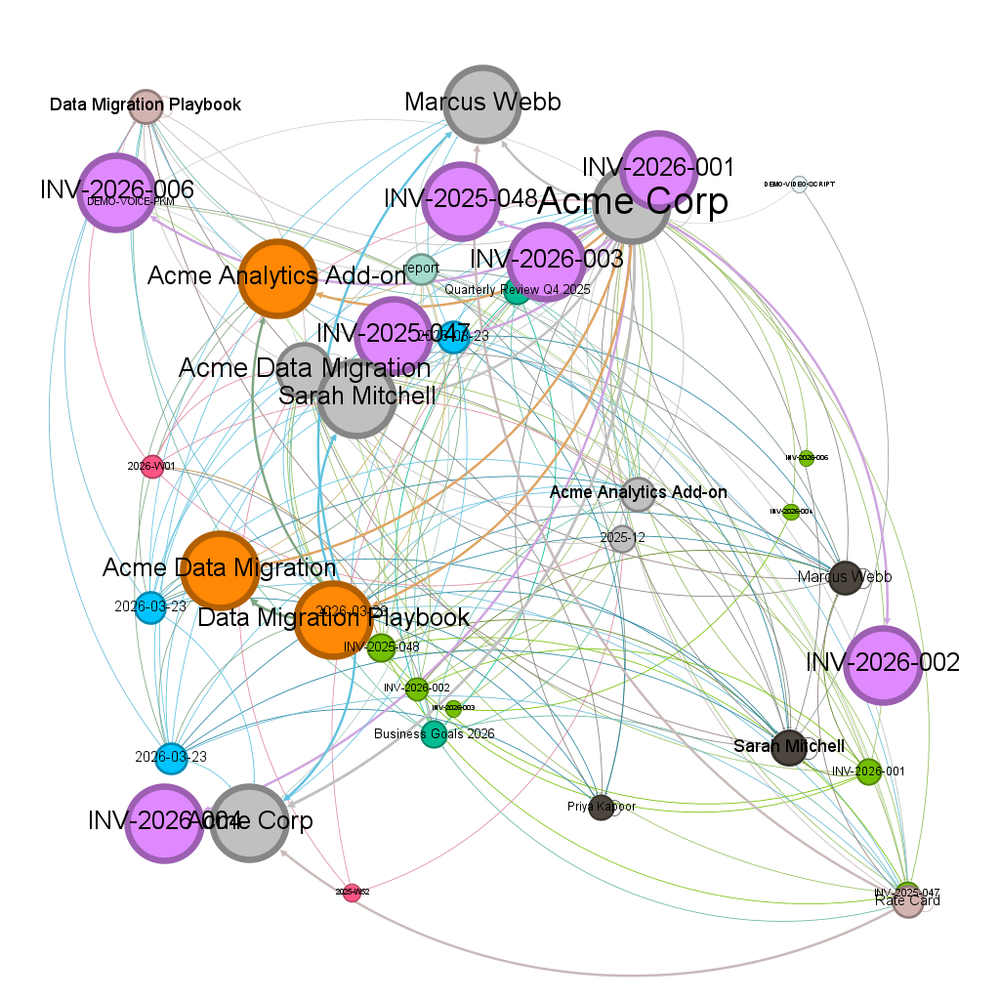

<div align="center">
  
  <h1>Flywheel</h1>
  <p><strong>Cognitive sovereignty for your Obsidian vault.</strong><br/>
  Search, write, and graph tools that auto-link your notes and learn from your edits.<br/>
  All local. All yours. A few lines of config.</p>
</div>

[](https://www.npmjs.com/package/@velvetmonkey/flywheel-memory)
[](https://modelcontextprotocol.io/)
[](https://github.com/velvetmonkey/flywheel-memory/actions/workflows/ci.yml)
[](https://www.gnu.org/licenses/agpl-3.0)
[](docs/SETUP.md)
[](https://github.com/velvetmonkey/flywheel-memory)
[-brightgreen.svg)](docs/TESTING.md#retrieval-benchmark-hotpotqa)
[](docs/TESTING.md#retrieval-benchmark-locomo)
[](docs/TESTING.md)

**[See It Work](#see-it-work)** · **[Try It](#try-it)** · **[What Makes It Different](#what-makes-flywheel-different)** · **[Benchmarked](#benchmarked)** · **[Tested](#tested)** · **[Docs](#documentation)**

> **Cognitive sovereignty** = your knowledge, your models, your rules, executed locally with explicit control.

| | Without | With Flywheel |
|---|---|---|
| Your data | Leaves your machine | Stays local. No sync, no upload, no account |
| Model choice | Locked to one provider | Model-agnostic via MCP. Swap anytime |
| As models improve | Migration or vendor upgrade | Better answers automatically: smarter models reason over the same data |
| "What's overdue?" | Read every file | Indexed query, <10ms |
| "What links here?" | Grep the vault, flat list | Ranked backlinks + outlinks, pre-indexed |
| "Add a meeting note" | Raw write, no linking | Auto-wikilinks on every mutation |
| "What should I link?" | Not possible | 13-layer scoring engine + semantic search |
| Your graph | Owned by the platform | Yours to [export](https://en.wikipedia.org/wiki/GraphML), analyse, or delete |
| Tool calls | Hidden behind abstractions | Traceable, auditable, git-committed |

### Who this is for

**For** people who want control over their knowledge: developers, researchers, solo operators, and anyone who treats their notes as infrastructure, not disposable input. The people who use AI the most [want more control, not less](https://x.com/AnthropicAI/status/2036499691571953848). Also works as persistent memory for bots and agents via the `agent` preset.

**Not for** people who want a hosted service. Flywheel runs on your machine, on your files. If you want cloud-managed knowledge, this isn't it.

---

## See It Work

### Read: "How much have I billed Acme Corp?"

From the [carter-strategy](demos/carter-strategy/) demo: a solo consultant with 3 clients, 5 projects, and $27K in invoices.

<video src="https://github.com/user-attachments/assets/ec1b51a7-cb30-4c49-a35f-aa82c31ec976" autoplay loop muted playsinline width="100%"></video>

One search call returned everything: metadata (frontmatter) with amounts and status, backlink lists, outlink lists. Zero file reads needed. The graph did the joining, not the AI reading files one by one.

### Write: Auto-wikilinks on every mutation

```
❯ Log that Stacy reviewed the security checklist before the Beta Corp kickoff

● flywheel › vault_add_to_section
  path: "daily-notes/2026-01-04.md"
  section: "Log"
  suggestOutgoingLinks: true
  content: "[[Stacy Thompson|Stacy]] reviewed the [[API Security Checklist|security checklist]]
            before the [[Beta Corp Dashboard|Beta Corp]] kickoff
            → [[GlobalBank API Audit]], [[Acme Data Migration]]"
            ↑ 3 known entities auto-linked ("Stacy" resolved via alias, 100% precision)
            → 2 suggested links: entities co-occurring with Stacy + security across past notes
```

You typed a plain sentence. Flywheel recognized three entities and linked them: entity names, aliases, and fuzzy matches scored across [13 dimensions](docs/ALGORITHM.md). Links you keep strengthen future scoring; links you edit out get suppressed. The system learns.

`→` suggestions are off by default. Enable with `suggestOutgoingLinks: true` for daily notes, meeting logs, and voice capture. Anywhere you want the graph to grow organically. [Configuration guide →](docs/CONFIGURATION.md)

### Boundaries in action

```
You: "Log that I reviewed the security audit with Sarah before the Beta Corp deadline"

Flywheel:
  → vault_add_to_section("daily-notes/2026-03-24.md", "Log", ...)
  → Auto-links: [[Sarah Mitchell|Sarah]], [[Security Audit|security audit]], [[Beta Corp]]
  → Suggests: → [[GlobalBank API Audit]], [[Compliance Matrix]]
  → Git commit: 1 file changed, 1 insertion

What happened                         What didn't
✓ One explicit tool call              ✗ No hidden tool chains
✓ Every link visible before write     ✗ No files touched outside vault
✓ One reversible git commit           ✗ Nothing sent to cloud
```

> **Reproduce it yourself:** The carter-strategy demo includes a [`run-demo-test.sh`](demos/carter-strategy/run-demo-test.sh) script that runs all five beats end-to-end via `claude -p`, verifying tool usage and vault state between each step.

---

## Try It

### Quick start (60 seconds)

```bash
git clone https://github.com/velvetmonkey/flywheel-memory.git
cd flywheel-memory/demos/carter-strategy && claude
```

Then ask: *"How much have I billed Acme Corp?"*

| Demo | You are | Ask this |
|------|---------|----------|
| [carter-strategy](demos/carter-strategy/) | Solo consultant | "How much have I billed Acme Corp?" |
| [artemis-rocket](demos/artemis-rocket/) | Rocket engineer | "What's blocking propulsion?" |
| [nexus-lab](demos/nexus-lab/) | PhD researcher | "How does AlphaFold connect to my experiment?" |
| [zettelkasten](demos/zettelkasten/) | Zettelkasten student | "How does spaced repetition connect to active recall?" |

### Install on your own vault

Add `.mcp.json` to your vault root:

```json
{
  "mcpServers": {
    "flywheel": {
      "command": "npx",
      "args": ["-y", "@velvetmonkey/flywheel-memory"]
    }
  }
}
```

```bash
cd /path/to/your/vault && claude
```

Flywheel does not replace Obsidian. It runs alongside as a background index. Watches for changes, indexes in real-time, and makes the full graph available to any AI client. No proprietary format, no cloud sync, no account. Delete `.flywheel/state.db` and it rebuilds from scratch.

### Configure your tools

| Preset | Tools | What you get |
|--------|-------|--------------|
| `default` | 16 | search, read, write, tasks |
| `agent` | 16 | search, read, write, memory |
| `full` | 66 | Everything except memory (all 12 categories) |

Start with `default`. Add bundles as you need them: `graph` (includes GraphML export for Gephi/Cytoscape), `schema`, `wikilinks`, `temporal`, `diagnostics`, and more.

```json
{ "env": { "FLYWHEEL_TOOLS": "default,graph" } }
```

[Browse all 70 tools →](docs/TOOLS.md) | [Preset recipes →](docs/CONFIGURATION.md)

<details>
<summary><strong>Windows users — read this before you start</strong></summary>

Three things differ from macOS/Linux:
1. **`cmd /c npx`** instead of `npx`: Windows installs npx as a `.cmd` batch script that can't be spawned directly
2. **`VAULT_PATH`**: set this to your vault's Windows path
3. **`FLYWHEEL_WATCH_POLL: "true"`**: **required**. Without this, Flywheel won't pick up changes you make in Obsidian.

See [docs/CONFIGURATION.md#windows](docs/CONFIGURATION.md#windows) for the full config example.
</details>

**Using Cursor, Windsurf, VS Code, or another editor?** See [docs/SETUP.md](docs/SETUP.md) for your client's config.

---

## What Makes Flywheel Different

### 1. Enriched Search

Every search result comes back enriched: frontmatter, scored backlinks, scored outlinks, and content snippets, all from an in-memory index. Results are multi-hop: a search for "Acme Corp" returns the client note *and* its connected invoices, projects, and people, each ranked by graph relevance. One call, not ten file reads.

With semantic embeddings enabled, "login security" finds notes about authentication without that exact keyword. Everything runs locally. SQLite full-text search (BM25), in-memory embeddings for semantic similarity, fused together for best-of-both results.

### 2. Every Link Has a Reason

Those `→` suggestions aren't random. Ask why Flywheel suggested `[[Marcus Johnson]]`:

```
Entity              Score  Match  Co-oc  Type  Context  Recency  Cross  Hub  Feedback  Semantic  Edge
---------------------------------------------------------------------------------------------------
Marcus Johnson        34    +10     +3    +5     +5       +5      +3    +1     +2         0       0
```

13 scoring layers, every number traceable to vault usage. Recency from what you last wrote. Co-occurrence from notes you've written before. Hub score from eigenvector centrality (not just how many notes link there, but how important those linking notes are). The score learns as you use it.

See [docs/ALGORITHM.md](docs/ALGORITHM.md) for how scoring works.

### 3. Use It and It Gets Smarter

Every sentence you write through Flywheel makes your graph denser. A denser graph gives better search results, richer backlinks, and sharper suggestions. That's the flywheel.

- **Proactive linking:** edit a note in Obsidian and Flywheel links it in the background. The file watcher scores every unlinked entity mention and inserts wikilinks that clear the threshold (score ≥ 20, max 3 per file, max 10 per day). Your graph grows while you write. Tune the thresholds via the `flywheel_config` tool, or disable it entirely.
- **Co-occurrence** builds over time. Two entities appearing in 20 notes form a statistical bond
- **Edge weights** accumulate. Links that survive edits gain influence
- **Suppression** learns. Connections you repeatedly break stop being suggested

Static tools give you the same results on day 1 and day 100. Flywheel's suggestions on day 100 are informed by everything you've written and edited since day 1. No retraining, no configuration, no manual curation.

### 4. Agentic Memory & Policies

Your AI knows what you were working on yesterday without re-explaining it. `brief` delivers startup context, `recall` retrieves across notes, entities (people, projects, concepts), and memories in one call, and `memory` stores observations that persist across sessions with automatic decay.

Complex vault workflows become deterministic policies. Describe what you want, the AI authors the YAML, and you can execute it on demand. All steps succeed or all roll back, committed as a single git commit.

Most agent frameworks solve the trust problem through containment: sandboxing arbitrary code in isolates or containers. Flywheel solves it through constraint: policies can only express vault operations, every step is auditable, and the entire execution is a single reversible git commit. No sandbox needed when the language itself can't do anything dangerous.

Under the hood, every write operation parses your markdown at the AST level, not regex, not string matching. Flywheel understands headings, frontmatter, lists, and code blocks as structure. Mutations target specific sections without corrupting surrounding content, even in complex documents. Safe writes aren't a promise. They're a property of the parser.

### 5. Portable Knowledge Graph

One call to `export_graph` and your entire vault (or any entity's neighborhood) becomes a [GraphML](https://en.wikipedia.org/wiki/GraphML) file. Open it in any graph tool, run community detection, find bottlenecks, or just see what's connected to what.



*"Show me everything connected to Acme Corp." One call: `export_graph({ center_entity: "Acme Corp" })`. [[Sarah Mitchell]] is the single contact linking 3 projects to the client. The [[Data Migration Playbook]] bridges two engagements. Seven invoices, two team members, one proposal. All from plain markdown. [Try it yourself →](demos/carter-strategy/carter-strategy-acme.graphml)*

### 6. System Guarantees

These are rules, not preferences:

- **No surprise writes.** Tool-initiated mutations require explicit calls. Proactive linking (the only background write) is auditable (git-committed, score-thresholded, configurable) and can be disabled entirely.
- **No hidden tool execution.** Every tool call is visible, scoped, and logged.
- **No required cloud dependency.** Core indexing, search, and graph run locally. No account, no sync, no phone-home.
- **All actions are auditable.** Every write is a git commit. Every commit is reversible. Every change has a reason.
- **No silent data exfiltration.** Your vault content is never sent anywhere except the AI model you chose to connect.

### How Flywheel compares

| | SaaS copilots | Agent frameworks | Flywheel |
|---|---|---|---|
| Execution | Guess, act silently | Chain tools opaquely | Explicit commands, scoped to vault |
| Data | Cloud-first | Cloud or hybrid | Local only. Your machine, your files |
| Trust model | "Trust us" | Trust the sandbox | Trust the constraint |
| Auditability | Opaque | Partial | Every action is a git commit |
| Model lock-in | Total | Varies | None. MCP is model-agnostic |

---

## Benchmarked

Measured on standard academic datasets. Reproducible on your machine: [`demos/hotpotqa/`](demos/hotpotqa/) | [`demos/locomo/`](demos/locomo/)

### Document Retrieval (HotpotQA)

500 multi-hop questions across 4,960 documents. End-to-end via real Claude sessions, not a component test. Zero training data.

| System | Type | Recall | |
|---|---|---|---|
| **Flywheel** | General-purpose MCP tool | **89.6%** | Zero training, 500 questions, end-to-end via Claude |
| BM25 baseline | Industry-standard IR | ~70-75% | Standard academic baseline |
| [Baleen](https://arxiv.org/abs/2101.00436) | Trained retriever | ~85% | Stanford, NeurIPS 2021. Trained on HotpotQA |
| [MDR](https://arxiv.org/abs/2009.12756) | Trained retriever | ~88% | Meta AI, ICLR 2021. Trained on HotpotQA |

> **Not apples-to-apples.** Baleen/MDR are trained on HotpotQA; Flywheel has never seen it. Different test sizes, document pools, and settings; directionally useful, not a controlled comparison. [Details →](docs/TESTING.md#retrieval-benchmark-hotpotqa)

### Conversational Memory (LoCoMo)

600 questions across 10 conversations. Answer accuracy via LLM-as-judge.

| System | Single-hop | Multi-hop | Commonsense | Questions | Judge |
|---|---|---|---|---|---|
| **Flywheel** | **59.2%** | **32.5%** | **65.8%** | 600 | Claude Haiku |
| [Mem0](https://mem0.ai/) | 38.7 | 28.6 | — | 695 | GPT-4o |
| [Zep](https://getzep.com/) | 35.7 | 19.4 | — | 695 | GPT-4o |
| [LangMem](https://github.com/langchain-ai/langmem) | 35.5 | 26.0 | — | 695 | GPT-4o |
| [Letta](https://memgpt.ai/) | 26.7 | — | — | 695 | GPT-4o |

> **Not apples-to-apples.** Different question counts, judge models (Haiku vs GPT-4o), and note representations; directionally useful, not a controlled comparison. [Details →](docs/TESTING.md#retrieval-benchmark-locomo)

[Full benchmark methodology →](docs/TESTING.md)

---

## Tested

2,579 tests across read, write, security, concurrency, and graph quality. CI-gated on Ubuntu + Windows, Node 20 + 22.

- **Graph quality:** 100% wikilink precision on ground truth vault, stress-tested over 50 generations with realistic noise. [Report →](docs/QUALITY_REPORT.md)
- **Live AI testing:** real `claude -p` sessions verify tool adoption end-to-end, not just handler logic
- **Write safety:** git-backed conflict detection, atomic rollback, 100 parallel writes with zero corruption
- **Security:** SQL injection, path traversal, Unicode normalization, permission bypass

[Full methodology and results →](docs/TESTING.md)

---

## Documentation

| Doc | Why read this |
|---|---|
| [PROVE-IT.md](docs/PROVE-IT.md) | **Start here.** See it working in 5 minutes |
| [TOOLS.md](docs/TOOLS.md) | All 70 tools documented |
| [COOKBOOK.md](docs/COOKBOOK.md) | Example prompts by use case |
| [SETUP.md](docs/SETUP.md) | Full setup guide for your vault |
| [CONFIGURATION.md](docs/CONFIGURATION.md) | Env vars, presets, custom tool sets |
| [ALGORITHM.md](docs/ALGORITHM.md) | How the scoring works |
| [ARCHITECTURE.md](docs/ARCHITECTURE.md) | Index strategy, graph, auto-wikilinks |
| [TESTING.md](docs/TESTING.md) | Test methodology and benchmarks |
| [TROUBLESHOOTING.md](docs/TROUBLESHOOTING.md) | Error recovery and diagnostics |
| [VISION.md](docs/VISION.md) | Where this is going |

---

## The Story Behind This

I've been writing code for over 30 years and tried every PKM tool going before landing on Obsidian. Flywheel is my third attempt at wiring AI into a knowledge vault. The first two failed because writes were non-deterministic and context didn't flow between sessions. This version unifies everything: one server with deterministic mutations, hybrid search, and a graph that compounds with use. The architecture exists because I kept hitting the same walls and refusing to stop.

Your attention, memory, and even the way you reason are increasingly shaped by systems you didn't choose. Platforms that optimise for engagement, models trained on someone else's priorities, defaults that quietly steer how you organise what you know. I wanted a knowledge layer that works for the person using it. A system that only gets smarter from your own honest engagement is fundamentally different from one that optimises for someone else's metrics.

The entire codebase was built through Claude Code with Opus 4.5 and 4.6. I designed the architecture and made every decision, but I haven't read every line 🫠 I've got bills to pay. It's been through extensive code reviews and testing, but verify what matters to you.

I dogfood it daily through a Telegram bot using voice input, because I'm a lazy nerd who'd rather talk than type. The volume of knowledge you can accumulate at speed through voice is staggering. Flywheel exists partly because I needed something that could keep up. All help is welcome. I'm looking for people who care about this space.

I'm also building [Flywheel Crank](https://github.com/velvetmonkey/flywheel-crank), an Obsidian plugin that surfaces suggestions, graph visibility, and management tools directly in the editor.

### Dogfooding: my vault, unvarnished

1,600-note vault, 2.5 years of daily notes, work docs, and projects.

| Period | Links per daily note |
|--------|---------------------|
| Pre-Flywheel (manual) | 3–11 |
| Post-Flywheel (3 months) | 20–625 |

The high end includes auto-logged bot conversations, but even quiet days run 20–30 links where they used to be 3–5. 88% of notes connected. The connections grow faster than the content. That's the flywheel.

---

## License

AGPL-3.0. See [LICENSE](./LICENSE) for details. The source stays open. If someone forks this and offers it as a service, they must publish their changes. Your data is local; the code is transparent.

> Your knowledge. Your graph. Your terms.
